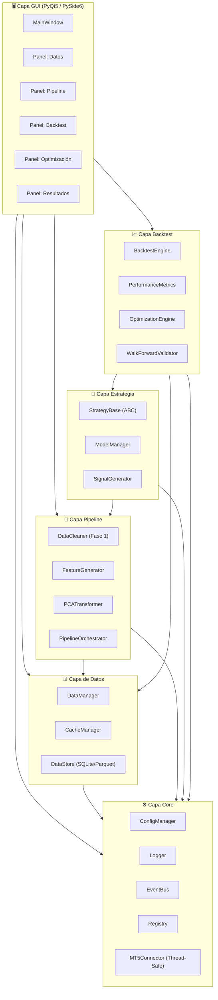
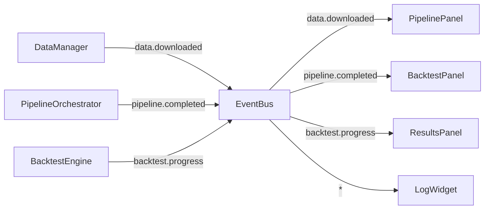
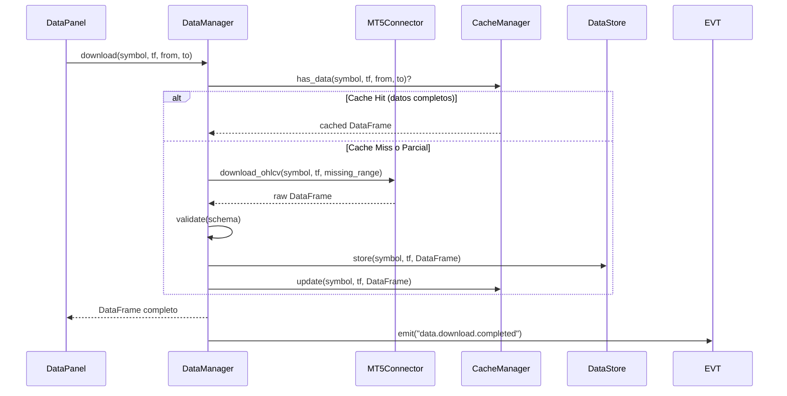
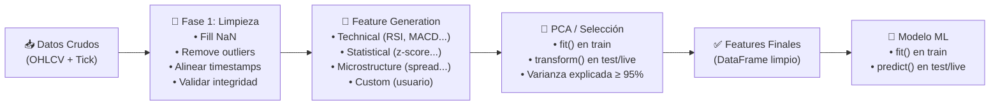
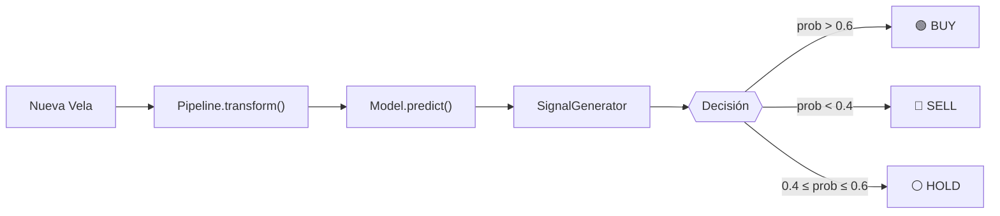
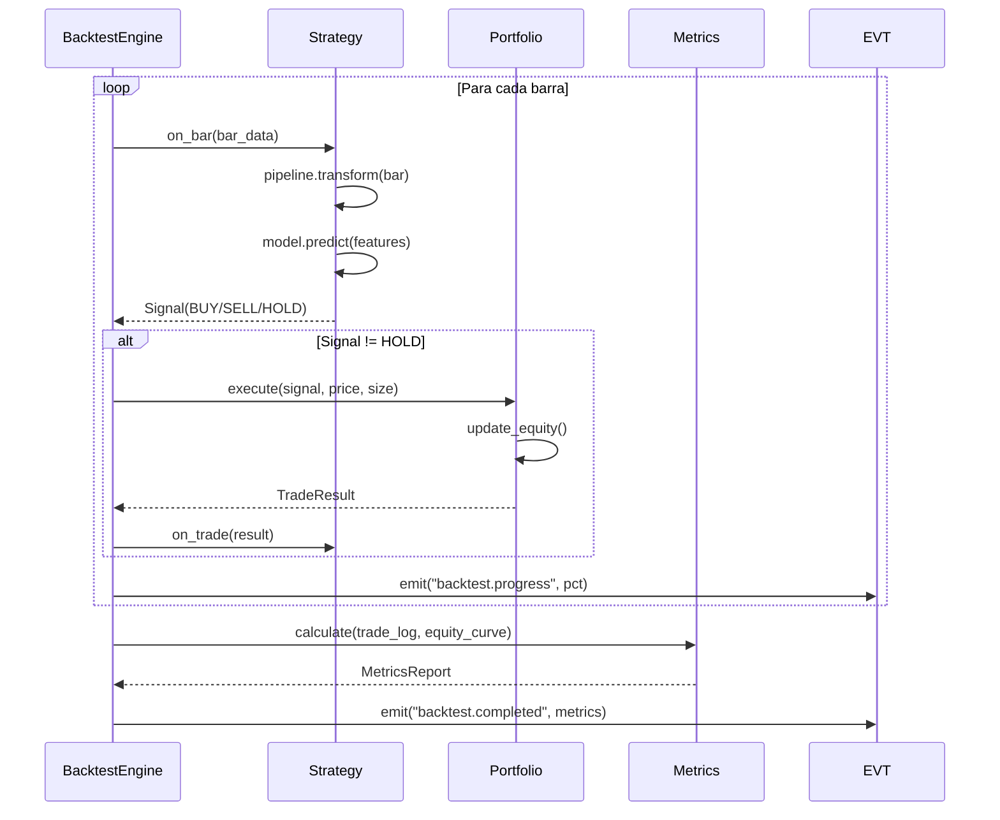
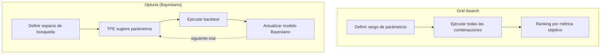
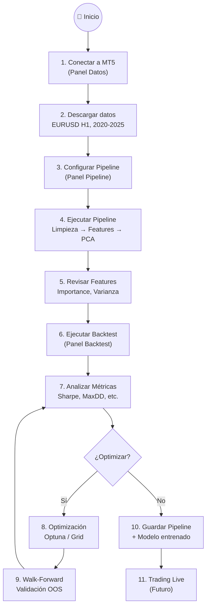

# 🏗️ NotOverfitting — Arquitectura de Trading con MetaTrader 5

> Sistema modular, escalable y reproducible para descarga de datos, feature engineering, backtesting y operación en tiempo real sobre MetaTrader 5.

**Python 3.9.12** · GUI monolítica (una sola ventana) · Pipeline reproducible backtest ↔ live

---

## 1. Visión General — Diagrama de Capas



---

## 2. Estructura de Directorios

```
NotOverfitting/
│
├── main.py                         # Entry point → lanza la GUI
├── requirements.txt
├── config/
│   ├── default.yaml                # Config por defecto (symbols, timeframes, paths)
│   └── logging.yaml                # Config de logging
│
├── src/                            # 🚀 Código fuente de la aplicación
│   ├── core/                       # ⚙️ Capa Core — sin dependencias externas pesadas
│   │   ├── __init__.py
│   │   ├── config_manager.py       # Carga/merge de YAML, acceso tipado
│   │   ├── event_bus.py            # Pub/Sub desacoplado entre módulos
│   │   ├── logger.py               # Wrapper de logging con rotación
│   │   ├── registry.py             # Registro dinámico de estrategias/features
│   │   ├── mt5_connector.py        # Singleton Thread-Safe para MT5 (descarga y órdenes)
│   │   └── exceptions.py           # Excepciones custom del sistema
│   │
│   ├── data/                       # 📊 Capa de Datos
│   │   ├── __init__.py
│   │   ├── data_manager.py         # Orquesta descarga, validación, almacenamiento
│   │   ├── cache_manager.py        # Cache inteligente con invalidación por fecha
│   │   ├── data_store.py           # Persistencia (SQLite metadata + Parquet datos)
│   │   └── schemas.py              # Dataclasses/Pydantic para validación de datos
│   │
│   ├── pipeline/                   # 🔬 Capa Pipeline (reproducible backtest ↔ live)
│   │   ├── __init__.py
│   │   ├── orchestrator.py         # Ejecuta el pipeline completo de forma idéntica
│   │   ├── cleaner.py              # Fase 1: limpieza (NaN, outliers, gaps)
│   │   ├── feature_generator.py    # Registro de features con decoradores
│   │   ├── pca_transformer.py      # PCA con fit/transform separados
│   │   ├── base.py                 # Clase base PipelineStep (ABC)
│   │   └── features/               # Directorio de features modulares
│   │       ├── __init__.py
│   │       ├── technical.py        # RSI, MACD, Bollinger, ATR...
│   │       ├── statistical.py      # Rolling stats, z-scores, skew...
│   │       ├── microstructure.py   # Spread, volume profile, VWAP...
│   │       └── custom.py           # Features del usuario
│   │
│   ├── strategy/                   # 🧠 Capa Estrategia
│   │   ├── __init__.py
│   │   ├── base.py                 # StrategyBase ABC (on_bar, on_signal)
│   │   ├── model_manager.py        # Entrena, serializa, carga modelos (joblib/pickle)
│   │   ├── signal_generator.py     # Traduce predicción → señal (BUY/SELL/HOLD)
│   │   └── strategies/             # Directorio de estrategias concretas
│   │       ├── __init__.py
│   │       └── example_ml_strategy.py  # Ejemplo: estrategia basada en ML
│   │
│   ├── backtest/                   # 📈 Capa Backtest
│   │   ├── __init__.py
│   │   ├── engine.py               # Motor de backtest event-driven
│   │   ├── portfolio.py            # Gestión de posiciones, equity, margin
│   │   ├── metrics.py              # Sharpe, Sortino, MaxDD, Calmar, Win Rate...
│   │   ├── optimization.py         # Grid search, random search, Optuna
│   │   └── walk_forward.py         # Walk-forward analysis / validación temporal
│   │
│   ├── gui/                        # 🖥️ Capa GUI
│   │   ├── __init__.py
│   │   ├── main_window.py          # Ventana principal con QTabWidget
│   │   ├── widgets/                # Widgets reutilizables
│   │   │   ├── __init__.py
│   │   │   ├── data_panel.py       # Panel de descarga y visualización de datos
│   │   │   ├── pipeline_panel.py   # Panel de configuración del pipeline
│   │   │   ├── backtest_panel.py   # Panel de backtesting
│   │   │   ├── optimization_panel.py
│   │   │   ├── results_panel.py    # Panel de resultados y métricas
│   │   │   ├── chart_widget.py     # Gráfico de velas + indicadores
│   │   │   └── log_widget.py       # Visor de logs en tiempo real
│   │   ├── styles/
│   │   │   └── dark_theme.qss      # Stylesheet para tema oscuro
│   │   └── resources/              # Iconos, imágenes
│   │
│   └── live/                       # 🔴 Capa Live Trading (futura)
│       ├── __init__.py
│       ├── executor.py             # Ejecuta órdenes en MT5
│       ├── risk_manager.py         # Gestión de riesgo en tiempo real
│       └── monitor.py              # Monitor de posiciones abiertas
│
└── tests/                          # 🧪 Tests
    ├── test_pipeline.py
    ├── test_backtest.py
    ├── test_data.py
    └── test_strategies.py
```

---

## 3. Capa Core — Fundación del Sistema

### 3.1 EventBus (Pub/Sub)

Permite comunicación desacoplada entre módulos. Cualquier módulo puede emitir eventos sin conocer quién los consume.



**Eventos clave del sistema:**


| Evento                    | Emisor         | Payload                          |
| ------------------------- | -------------- | -------------------------------- |
| `data.download.started`   | DataManager    | `{symbol, timeframe}`            |
| `data.download.completed` | DataManager    | `{symbol, timeframe, rows}`      |
| `data.download.error`     | DataManager    | `{symbol, error}`                |
| `pipeline.step.completed` | Orchestrator   | `{step_name, shape}`             |
| `pipeline.completed`      | Orchestrator   | `{features_shape, time_elapsed}` |
| `backtest.progress`       | BacktestEngine | `{pct_complete, current_date}`   |
| `backtest.completed`      | BacktestEngine | `{metrics_dict}`                 |
| `optimization.trial`      | OptEngine      | `{trial_n, params, score}`       |
| `log.message`             | Logger         | `{level, message, module}`       |

### 3.2 ConfigManager

```yaml
# config/default.yaml
mt5:
  login: null          # Se configura en GUI
  password: null
  server: null
  timeout: 10000

data:
  default_symbols: ["EURUSD", "GBPUSD", "USDJPY"]
  default_timeframe: "H1"
  storage_path: "./data_store"
  cache_days: 30

pipeline:
  cleaner:
    fill_method: "ffill"
    outlier_std: 3.0
    min_data_pct: 0.95
  pca:
    variance_threshold: 0.95
    max_components: 50

backtest:
  initial_capital: 10000
  commission_pct: 0.001
  slippage_pips: 1
  position_size: 0.01
```

### 3.3 Registry Pattern

Permite registrar features, estrategias y pasos de pipeline de forma dinámica, sin modificar código existente:

```
Registry
├── features:    {"rsi_14": RSI14Feature, "macd": MACDFeature, ...}
├── strategies:  {"ml_xgb": XGBStrategy, "ml_rf": RFStrategy, ...}
└── pipelines:   {"default": DefaultPipeline, ...}
```

> [!TIP]
> El patrón Registry + decoradores permite a cualquier desarrollador agregar nuevas features o estrategias simplemente creando un archivo nuevo con un decorador `@register_feature("nombre")`, sin tocar ningún otro módulo.

### 3.4 MT5Connector (Thread-Safe)

Ubicado en `core/` como un Singleton con control de concurrencia (`threading.Lock()`). Dado que la librería `MetaTrader5` maneja un estado global en el intérprete de Python, este componente centraliza **todas** las llamadas a la API de MetaTrader (ya sea descarga de históricos desde `data` o envío de órdenes desde `live`). Esto evita desconexiones, bloqueos o colisiones cuando el bot opere en tiempo real.


| Método                                | Descripción                                  |
| -------------------------------------- | --------------------------------------------- |
| `connect(login, password, server)`     | Inicializa conexión MT5 con lock             |
| `disconnect()`                         | Cierra conexión limpiamente                  |
| `download_ohlcv(symbol, tf, from, to)` | Descarga datos OHLCV de forma segura con lock |
| `get_symbols()`                        | Lista símbolos disponibles en el broker      |
| `get_tick_data(symbol, from, to)`      | Descarga datos tick-by-tick                   |
| `send_order(request)`                  | Envía orden al mercado (encolada vía lock)  |
| `get_positions()`                      | Consulta posiciones abiertas                  |

---

## 4. Capa de Datos — Gestión de la Información

### 4.1 Flujo de Datos



### 4.2 Almacenamiento Dual


| Componente      | Formato                | Propósito                                                  |
| --------------- | ---------------------- | ----------------------------------------------------------- |
| **Metadata**    | SQLite                 | Registro de qué datos existen, rangos de fechas, checksums |
| **Datos OHLCV** | Parquet (particionado) | Datos reales, comprimidos, lectura rápida con pandas       |

Estructura en disco:

```
data_store/
├── metadata.db                     # SQLite: catálogo de datos
├── ohlcv/
│   ├── EURUSD/
│   │   ├── H1/
│   │   │   ├── 2024.parquet
│   │   │   └── 2025.parquet
│   │   └── M15/
│   │       └── ...
│   └── GBPUSD/
│       └── ...
└── cache/                          # Cache temporal en memoria/disco
```

---

## 5. Capa Pipeline — Reproducibilidad Total

> [!IMPORTANT]
> **Principio fundamental:** El pipeline debe producir **exactamente el mismo output** dado el mismo input, ya sea en backtest o en tiempo real. Esto se logra separando estrictamente `fit()` de `transform()`.

### 5.1 Interfaz Base — PipelineStep

Cada paso del pipeline implementa esta interfaz:

```
PipelineStep (ABC)
├── name: str
├── fit(df: DataFrame) → self             # Aprende parámetros (solo en train)
├── transform(df: DataFrame) → DataFrame  # Aplica transformación (train y live)
├── fit_transform(df: DataFrame) → DataFrame
├── get_params() → dict                   # Para serialización
└── set_params(params: dict) → self       # Para deserialización
```

### 5.2 Pipeline Completo — Flujo Visual



### 5.3 Orquestador del Pipeline

El `PipelineOrchestrator` es el corazón de la reproducibilidad:

```
PipelineOrchestrator
│
├── steps: List[PipelineStep]        # Lista ordenada de pasos
├── fitted_params: dict              # Parámetros aprendidos en fit
│
├── fit(train_df) → self
│   │  Para cada step:
│   │    step.fit(df)
│   │    df = step.transform(df)
│   │    guardar step.get_params()
│   └── return self
│
├── transform(new_df) → DataFrame
│   │  Para cada step:
│   │    df = step.transform(df)  ← usa params de fit()
│   └── return df
│
├── save(path) → None                # Serializa pipeline completo (joblib)
├── load(path) → PipelineOrchestrator # Carga pipeline pre-fitted
│
└── run(df, mode="backtest"|"live") → DataFrame
    │  if mode == "backtest":
    │    split train/test
    │    fit(train), transform(test)
    │  elif mode == "live":
    │    load fitted params
    │    transform(new_data)
    └── return features
```

### 5.4 Sistema de Features con Decoradores

```
@register_feature("rsi")
class RSIFeature(FeatureBase):
    """Relative Strength Index"""
  
    params:
      - period: int = 14
  
    depends_on: ["close"]
  
    def compute(df) → Series:
        # Cálculo del RSI
        return rsi_series
```

Ventajas:

- **Auto-discovery**: El Registry encuentra automáticamente todas las features registradas
- **Declarativo**: Cada feature declara sus dependencias y parámetros
- **Extensible**: Agregar una feature nueva = crear 1 archivo, 0 modificaciones en otros módulos

---

## 6. Capa de Estrategia

### 6.1 StrategyBase — Clase Abstracta

```
StrategyBase (ABC)
│
├── name: str
├── pipeline: PipelineOrchestrator
├── model: ModelManager
│
├── on_init()                        # Inicialización de la estrategia
├── on_bar(bar: BarData)             # Se llama en cada nueva vela
├── generate_signal(features: df)    # Produce señal de trading
├── on_trade(trade: TradeResult)     # Callback post-ejecución
│
├── fit(train_data) → self           # Entrena pipeline + modelo
├── predict(new_data) → Signal       # Pipeline.transform → Model.predict → Signal
│
└── get_config() → dict              # Serialización de la estrategia completa
```

### 6.2 Flujo de Señal



### 6.3 ModelManager


| Responsabilidad            | Descripción                                   |
| -------------------------- | ---------------------------------------------- |
| `train(X, y, model_type)`  | Entrena modelo (XGBoost, RF, LightGBM, etc.)   |
| `predict(X)`               | Predicción con modelo entrenado               |
| `save(path)`               | Serializa modelo + metadatos                   |
| `load(path)`               | Carga modelo serializado                       |
| `get_importance()`         | Feature importance del modelo                  |
| `cross_validate(X, y, cv)` | Validación cruzada temporal (TimeSeriesSplit) |

---

## 7. Capa de Backtest

### 7.1 BacktestEngine — Event-Driven



### 7.2 Métricas Calculadas


| Categoría        | Métricas                                      |
| ----------------- | ---------------------------------------------- |
| **Retorno**       | Total Return, CAGR, Monthly Returns            |
| **Riesgo**        | Max Drawdown, Volatilidad, VaR, CVaR           |
| **Ratios**        | Sharpe, Sortino, Calmar, Profit Factor         |
| **Trading**       | Win Rate, Avg Win/Loss, Max Consecutive Losses |
| **Estadísticas** | Trades totales, Exposure Time, Avg Duration    |

### 7.3 Optimización

Dos modos de optimización disponibles:



### 7.4 Walk-Forward Validation

> [!WARNING]
> El Walk-Forward es **crítico** para evitar overfitting. Sin él, cualquier resultado de optimización es sospechoso.

```
Datos totales: [=================================================]

Walk-Forward con 3 folds:

Fold 1: [===TRAIN===][=TEST=]
Fold 2:     [===TRAIN===][=TEST=]
Fold 3:         [===TRAIN===][=TEST=]

Out-of-Sample combinado:        [=T1=][=T2=][=T3=]
```

---

## 8. Capa GUI — Diseño de la Interfaz

### 8.1 Layout Principal

```
┌──────────────────────────────────────────────────────────────────────┐
│  🔲 NotOverfitting v1.0                              [_] [□] [X]   │
├──────────────────────────────────────────────────────────────────────┤
│  [📊 Datos] [🔬 Pipeline] [📈 Backtest] [⚡ Optimización] [📋 Log] │
├──────────────────────────────────────────────────────────────────────┤
│                                                                      │
│  ┌─ Panel Activo (según tab seleccionado) ──────────────────────┐   │
│  │                                                               │   │
│  │                                                               │   │
│  │              Contenido dinámico del panel                     │   │
│  │                                                               │   │
│  │                                                               │   │
│  └───────────────────────────────────────────────────────────────┘   │
│                                                                      │
│  ┌─ Panel Inferior (siempre visible) ───────────────────────────┐   │
│  │  📊 Gráfico de Velas / Equity Curve (contextual)             │   │
│  │  ▬▬▬▬▬▬▬▬▬▬▬▬▬▬▬▬▬▬▬▬▬▬▬▬▬▬▬▬▬▬▬▬▬▬▬▬▬▬▬▬▬▬▬▬▬▬▬▬▬▬▬▬    │   │
│  └───────────────────────────────────────────────────────────────┘   │
│                                                                      │
│  ┌─ Barra de Estado ────────────────────────────────────────────┐   │
│  │  MT5: 🟢 Conectado | Symbol: EURUSD | TF: H1 | 50,234 rows │   │
│  └───────────────────────────────────────────────────────────────┘   │
└──────────────────────────────────────────────────────────────────────┘
```

### 8.2 Detalle de cada Panel

#### 📊 Panel de Datos

```
┌─────────────────────────────────────────────────────────────┐
│  MT5 Conexión           │  Descarga de Datos                │
│  ┌───────────────────┐  │  Symbol: [EURUSD    ▼]            │
│  │ Login:  [_______] │  │  Timeframe: [H1     ▼]            │
│  │ Pass:   [_______] │  │  Desde: [2020-01-01  📅]          │
│  │ Server: [_______] │  │  Hasta: [2025-01-01  📅]          │
│  │ [🔌 Conectar]     │  │  [⬇️ Descargar] [🗑️ Limpiar Cache]│
│  │ Estado: 🟢        │  │                                    │
│  └───────────────────┘  │  Datos cargados: 50,234 filas     │
│                          │  Rango: 2020-01-01 → 2025-01-01  │
│─────────────────────────┴────────────────────────────────────│
│  📋 Vista Previa de Datos (tabla scrollable)                 │
│  ┌─────────────────────────────────────────────────────────┐ │
│  │ Date       │ Open   │ High   │ Low    │ Close  │ Vol   │ │
│  │ 2020-01-02 │ 1.1225 │ 1.1240 │ 1.1200 │ 1.1230 │ 5420 │ │
│  │ ...        │ ...    │ ...    │ ...    │ ...    │ ...   │ │
│  └─────────────────────────────────────────────────────────┘ │
└─────────────────────────────────────────────────────────────────┘
```

#### 🔬 Panel de Pipeline

```
┌─────────────────────────────────────────────────────────────┐
│  Configuración del Pipeline                                  │
│                                                               │
│  Fase 1: Limpieza          │  Fase 2: Features               │
│  ☑ Fill NaN (ffill)        │  ☑ RSI (14)                     │
│  ☑ Remove outliers (3σ)    │  ☑ MACD (12,26,9)               │
│  ☑ Alinear timestamps      │  ☑ Bollinger (20,2)             │
│  ☐ Remove weekends         │  ☑ ATR (14)                     │
│                             │  ☑ Z-Score (20)                 │
│  Fase 3: PCA               │  ☐ VWAP                         │
│  Varianza: [0.95___]       │  ☐ Custom: [________]           │
│  Max comp: [50_____]       │  [+ Agregar Feature]            │
│                             │                                  │
│  [▶️ Ejecutar Pipeline]     │  [💾 Guardar Config]            │
│─────────────────────────────┴──────────────────────────────── │
│  Resultado del Pipeline                                       │
│  ┌──────────────────────────────────────────────────────────┐│
│  │ Features generadas: 45  → PCA componentes: 12            ││
│  │ Varianza explicada: 96.3%                                 ││
│  │ Tiempo: 2.3s                                              ││
│  │ [📊 Ver Feature Importance] [📈 Ver Varianza Explicada]  ││
│  └──────────────────────────────────────────────────────────┘│
└─────────────────────────────────────────────────────────────────┘
```

#### 📈 Panel de Backtest

```
┌─────────────────────────────────────────────────────────────┐
│  Configuración                │  Ejecución                   │
│  Capital: [10000____]         │                               │
│  Comisión: [0.001___] %       │  ████████████░░░░░  67%      │
│  Slippage: [1_______] pips    │  Procesando: 2023-06-15      │
│  Tamaño: [0.01_____] lots     │                               │
│  Estrategia: [ML XGBoost ▼]  │  [▶️ Iniciar] [⏸ Pausar]    │
│  Split Train: [70____] %      │  [⏹ Detener]                 │
│                                │                               │
│──────────────────────────────────────────────────────────────│
│  📊 Resultados                                               │
│  ┌──────────────────────────────────────────────────────────┐│
│  │ Sharpe: 1.45  │ MaxDD: -12.3%  │ Win Rate: 58.2%        ││
│  │ CAGR: 23.1%   │ Calmar: 1.87   │ Profit Factor: 1.65   ││
│  │ Trades: 342    │ Avg Win: 45p   │ Avg Loss: -28p        ││
│  └──────────────────────────────────────────────────────────┘│
│  [📥 Exportar CSV] [📊 Ver Trades] [📈 Equity Curve]        │
└─────────────────────────────────────────────────────────────────┘
```

#### ⚡ Panel de Optimización

```
┌─────────────────────────────────────────────────────────────┐
│  Modo: (●) Optuna Bayesiano  ( ) Grid Search                │
│                                                               │
│  Parámetros a optimizar:                                     │
│  ┌──────────────────────────────────────────────────────────┐│
│  │ ☑ RSI Period     │ Min: [7___]  │ Max: [28__]  │ Step: 1││
│  │ ☑ MACD Fast      │ Min: [8___]  │ Max: [16__]  │ Step: 1││
│  │ ☑ PCA Components │ Min: [5___]  │ Max: [30__]  │ Step: 1││
│  │ ☐ Threshold Buy  │ Min: [0.5_]  │ Max: [0.8_]  │ ...   ││
│  └──────────────────────────────────────────────────────────┘│
│                                                               │
│  Trials: [100______]  │ Métrica: [Sharpe    ▼]              │
│  Walk-Forward: ☑      │ Folds: [3___]                       │
│                                                               │
│  [🚀 Optimizar] [⏹ Detener]                                 │
│──────────────────────────────────────────────────────────────│
│  Progreso: Trial 45/100  │ Mejor Sharpe: 1.67               │
│  ┌──────────────────────────────────────────────────────────┐│
│  │  Tabla de mejores trials (top 10)                        ││
│  │  #  │ RSI │ MACD │ PCA │ Sharpe │ MaxDD  │ PF           ││
│  │  1  │ 14  │ 12   │ 12  │ 1.67   │ -8.2%  │ 1.89        ││
│  │  2  │ 21  │ 10   │ 15  │ 1.58   │ -9.1%  │ 1.75        ││
│  └──────────────────────────────────────────────────────────┘│
└─────────────────────────────────────────────────────────────────┘
```

---

## 9. Patrones de Diseño Clave


| Patrón                   | Dónde                     | Por qué                                                                                |
| ------------------------- | -------------------------- | --------------------------------------------------------------------------------------- |
| **Observer / Pub-Sub**    | EventBus                   | Desacopla GUI de lógica. Los paneles reaccionan a eventos sin conocer quién los emite |
| **Strategy Pattern**      | StrategyBase               | Permite intercambiar estrategias sin cambiar el engine                                  |
| **Registry + Decorators** | Features, Strategies       | Auto-discovery, extensibilidad sin modificar código existente                          |
| **Pipeline / Chain**      | PipelineOrchestrator       | Composición flexible de pasos, reproducibilidad fit/transform                          |
| **Repository**            | DataStore                  | Abstrae el almacenamiento (hoy Parquet, mañana podría ser PostgreSQL)                 |
| **Singleton**             | ConfigManager, Logger      | Un solo punto de configuración y logging                                               |
| **Template Method**       | PipelineStep.fit_transform | Estructura fija con implementación variable por paso                                   |

---

## 10. Dependencias (requirements.txt)

```
# Core
MetaTrader5==5.0.45
pandas==1.4.4
numpy==1.21.6
PyYAML==6.0

# GUI
PyQt5==5.15.9

# Pipeline / ML
scikit-learn==1.0.2
xgboost==1.6.2
lightgbm==3.3.5
joblib==1.1.1

# Optimización
optuna==3.1.0

# Visualización
matplotlib==3.5.3
mplfinance==0.12.9b7
pyqtgraph==0.13.3

# Almacenamiento
pyarrow==8.0.0     # Para Parquet

# Utilidades
pydantic==1.10.7   # Validación de datos (compatible con 3.9)
```

> [!NOTE]
> Todas las versiones son compatibles con Python 3.9.12. Se usó `pydantic v1` porque v2 requiere Python ≥ 3.8 pero tiene cambios breaking; v1.10 es la más estable para 3.9.

---

## 11. Flujo Completo de Trabajo del Usuario



---

## 12. Plan de Implementación por Fases

### Fase 1 — Fundación (Core + Data)

- [ ]  `src/core/` — ConfigManager, EventBus, Logger, Registry, Exceptions, MT5Connector (Thread-Safe)
- [ ]  `src/data/` — DataManager, DataStore, CacheManager
- [ ]  `config/` — default.yaml, logging.yaml
- [ ]  Tests unitarios de Core y Data

### Fase 2 — Pipeline

- [ ]  `src/pipeline/base.py` — PipelineStep ABC
- [ ]  `src/pipeline/cleaner.py` — Fase 1 de limpieza
- [ ]  `src/pipeline/feature_generator.py` — Motor de features con decoradores
- [ ]  `src/pipeline/features/` — Features técnicas, estadísticas, microestructura
- [ ]  `src/pipeline/pca_transformer.py` — PCA con fit/transform
- [ ]  `src/pipeline/orchestrator.py` — Pipeline reproducible
- [ ]  Tests de reproducibilidad (same input → same output)

### Fase 3 — Estrategia + Backtest

- [ ]  `src/strategy/base.py` — StrategyBase ABC
- [ ]  `src/strategy/model_manager.py` — Train/predict/serialize
- [ ]  `src/strategy/signal_generator.py` — Lógica de señales
- [ ]  `src/backtest/engine.py` — Motor event-driven
- [ ]  `src/backtest/portfolio.py` — Gestión de posiciones
- [ ]  `src/backtest/metrics.py` — Cálculo de métricas
- [ ]  Tests de backtest con datos conocidos

### Fase 4 — GUI

- [ ]  `src/gui/main_window.py` — Ventana principal con tabs
- [ ]  `src/gui/widgets/data_panel.py` — Conexión MT5 + descarga
- [ ]  `src/gui/widgets/pipeline_panel.py` — Configuración del pipeline
- [ ]  `gui/widgets/backtest_panel.py` — Ejecución de backtest
- [ ]  `gui/widgets/results_panel.py` — Visualización de resultados
- [ ]  `gui/widgets/chart_widget.py` — Gráfico de velas
- [ ]  `gui/styles/dark_theme.qss` — Tema oscuro
- [ ]  Integración completa GUI ↔ Lógica vía EventBus

### Fase 5 — Optimización + Polish

- [ ]  `backtest/optimization.py` — Grid + Optuna
- [ ]  `backtest/walk_forward.py` — Walk-forward validation
- [ ]  `gui/widgets/optimization_panel.py` — Panel de optimización
- [ ]  `gui/widgets/log_widget.py` — Visor de logs
- [ ]  Documentación de usuario
- [ ]  Tests de integración end-to-end

### Fase 6 — Live Trading (Futura)

- [ ]  `live/executor.py` — Ejecución de órdenes
- [ ]  `live/risk_manager.py` — Gestión de riesgo
- [ ]  `live/monitor.py` — Monitor de posiciones

---

## User Review Required

> [!IMPORTANT]
> **Framework GUI**: Se propone **PyQt5** por madurez y ecosistema de widgets. Alternativas: PySide6 (licencia LGPL), Tkinter (más simple pero menos potente), DearPyGui (GPU-accelerated). ¿Alguna preferencia?

> [!IMPORTANT]
> **Motor de Backtest**: Se diseñó un motor **event-driven propio**. Alternativa: usar `Backtrader` o `vectorbt` como base y extenderlos. El motor propio da control total pero requiere más desarrollo. ¿Preferencia?

> [!IMPORTANT]
> **Modelos ML**: Se incluyeron XGBoost, LightGBM y scikit-learn. ¿Hay otros modelos o librerías que quieras incluir (e.g., PyTorch, TensorFlow para redes neuronales)?

## Open Questions

> [!NOTE]
> **Datos tick vs OHLCV**: ¿Necesitas soporte de datos tick desde el inicio, o es suficiente con OHLCV y se agrega tick después?

> [!NOTE]
> **Timeframes múltiples**: ¿Las estrategias necesitarán features de múltiples timeframes simultáneamente (e.g., H1 + D1)? Esto afecta el diseño del pipeline.

> [!NOTE]
> **Multi-símbolo**: ¿Se necesita backtesting simultáneo de múltiples pares (portfolio), o siempre será símbolo individual?

> [!NOTE]
> **Live Trading (Fase 6)**: ¿Quieres que la arquitectura de live trading se diseñe desde ahora (aunque no se implemente), o se diseña cuando llegue el momento?
